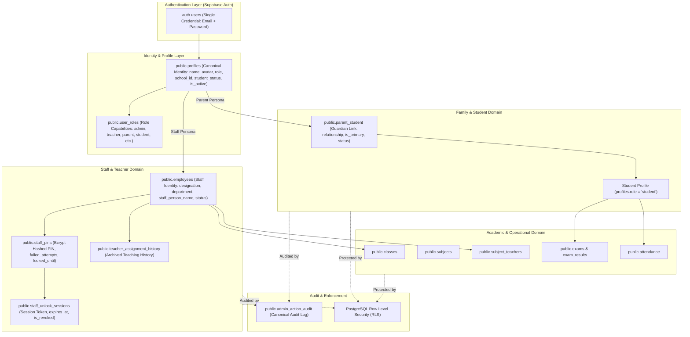

# Identity and Access Management Architecture

## 1. Overview & Conceptual Architecture

Kryin Ephor implements a unified, multi-tenant Identity & Access Management system designed for educational institutions. The system supports multi-persona users (such as a parent who is also a teacher, or a student with parent views) using a **single login credential** without account duplication or credential fragmentation.

### Architecture Diagram



---

## 2. Core Identity Elements

### 2.1 Auth Account (`auth.users`)
- Kryin Ephor intentionally supports both individual user logins and a **family-login container model**. A single `auth.users` account can anchor family access to multiple canonical students while preserving separate domain identities and individual academic records.
- If a parent becomes a teacher, or a teacher's child enrolls, no second auth account is created; domain capabilities are securely mapped to the existing account container.
- Password resets, MFA, and session tokens are anchored to this single login.

### 2.2 Profile (`public.profiles`)
- Stores canonical user metadata: `full_name`, `avatar_url`, `phone`, `school_id`, `student_status`, `is_active`, and `metadata`.
- `role`: Represents the primary active role (e.g. `'teacher'`, `'parent'`, `'student'`, `'admin'`).
- Protected by RLS: Users can update their own safe display preferences (name, avatar, phone), but cannot modify `role`, `school_id`, `student_status`, or `is_active`.

### 2.3 User Roles (`public.user_roles`)
- Maps multi-role capabilities to a single profile (`user_id`, `role`).
- Evaluated authority-wide via `public.has_role(user_id, role)`.
- Prevents client-side role manipulation: having a role in `user_roles` is mandatory for server-side authorization.

### 2.4 Staff Identity (`public.employees`)
- Separate staff employment entity linked to `profiles.id` via `profile_id`.
- Captures `designation`, `department`, `employee_code`, `status` (`'active'` | `'inactive'`), and `staff_person_name`.
- Solves the legacy bug where student names could bleed into teacher selectors. Teacher selectors pull the canonical staff identity from `employees.staff_person_name`.

### 2.5 Guardian Link (`public.parent_student`)
- Join relation between a guardian (`parent_id`) and student (`student_id`).
- Attributes: `relationship` (`'Mother'`, `'Father'`, `'Guardian'`), `is_primary` (boolean), `status` (`'active'` | `'inactive'` | `'unlinked'`).
- Manages 1..N children for a single family login. Multi-child isolation ensures that sibling academic marks and attendance remain strictly private.

---

## 3. Teacher Security & Unlock Lifecycle

Teachers who access privileged school data (grades, attendance, class management) must unlock Staff Mode using a dedicated Staff PIN.

```text
[Teacher Login] ──> [Enters App with Family View]
       │
       ▼ (Clicks "Switch to Teacher")
[PIN Prompt Modal] ──> [Calls fn_verify_staff_pin]
       │
       ├─► [Incorrect PIN < 5 Attempts] ──> Increments failed_attempts, Logs 'staff unlock failed'
       ├─► [5 Failed Attempts] ───────────> Locks PIN for 15 mins (ACCOUNT_LOCKED), Logs 'staff unlock locked'
       └─► [Valid PIN] ───────────────────> Issues 2-Hour Session Token, Logs 'staff unlock succeeded'
                                                   │
                                                   ▼
                                     [Unlocked Teacher Dashboard ✓]
```

### 3.1 PIN Storage & Protection (`public.staff_pins`)
- PINs are hashed using cryptographic `crypt(pin, gen_salt('bf', 10))`.
- Tracked counters: `failed_attempts` and `locked_until`.
- Managed via `fn_setup_or_change_staff_pin`: Requires active teacher capability and existing PIN verification or admin override.

### 3.2 Staff Unlock Sessions (`public.staff_unlock_sessions`)
- 2-hour maximum lifetime per session token.
- Auth-session-bound Staff unlock: bound to user identity, school tenant, and the active Supabase Auth session ID (`auth_session_id`). Rejects cross-session use (SESSION_MISMATCH).
- Supports immediate manual revocation (`Lock Staff` button) or automated bulk revocation upon teacher departure or account deactivation via `fn_admin_set_account_active`.

---

## 4. Account & Persona Lifecycle

### 4.1 Transition Matrix

| Event | Previous State | Action Taken | Resulting State | Historical Data |
| :--- | :--- | :--- | :--- | :--- |
| **Parent becomes Teacher** | Family-only | Admin adds Employee record + `'teacher'` role + PIN | Multi-persona (Parent + Teacher 🔒) | 100% preserved |
| **Child joins existing Teacher** | Teacher-only | Admin links student via `fn_link_student_guardian` | Multi-persona (Teacher + Parent) | 100% preserved |
| **Teacher leaves employment** | Teacher + Parent | Admin calls `fn_disable_teacher_access_internal` | Demoted to Parent-only | Teacher assignment history archived to `teacher_assignment_history` |
| **One child leaves school** | Multi-child Parent | Admin calls `fn_unlink_student_guardian` | Remaining children active | Departed child's past grades & attendance remain in school |
| **Student transfers / leaves** | Active Student | Admin calls `fn_set_student_status('withdrawn')` | Student marked withdrawn | Full academic history preserved; new enrollments blocked |
| **Last child unlinked (Teacher)** | Teacher + 1 child | Admin unlinks last child | Transitions to Teacher-only | Zero account deletion |
| **Last child unlinked (Non-Staff)**| Parent + 1 child | Admin unlinks last child | `has_active_persona = false`; prompts Admin | Account preserved for admin decision; zero hard delete |

---

## 5. Security & Row Level Security (RLS) Model

1. **Tenant Isolation**: Every operational table (`classes`, `exams`, `attendance`, `parent_student`, `employees`) enforces `school_id = get_auth_school_id()`. Cross-tenant linking and cross-school data access are strictly denied.
2. **Family Scope Isolation**:
   - Parents can only query student records where an active link exists in `parent_student`.
   - Direct REST/Supabase queries substituting arbitrary student IDs return 0 rows.
3. **Staff Capability Validation**:
   - `has_role(user_id, 'teacher')` is evaluated on every mutation.
   - Client-side storage tampering (`localStorage.setItem('role', 'teacher')`) has zero effect on the server authority.
4. **Data Deletion Policy**:
   - Deletion hierarchy: **UNLINK ➔ DEACTIVATE ➔ ARCHIVE / WITHDRAW ➔ HARD DELETE (Admin only)**.
   - Deleting a parent link or removing staff capability never cascades to student academic records.
   - Foreign keys to historical associations utilize `ON DELETE SET NULL`.

---

## 6. Audit Logging (`public.admin_action_audit`)

Every privileged lifecycle event records canonical audit telemetry:
- `actor_id` & `actor_role`: Who initiated the operation.
- `school_id`: Target tenant context.
- `target_user_id`: Target identity affected.
- `action`: Standardized action name (`child linked`, `child unlinked`, `teacher_access_disabled`, `student withdrawn`, `staff unlock failed`, `staff unlock locked`, `staff unlock succeeded`, `duplicate_detection_resolution`).
- `detail`: JSONB payload capturing complete before/after state transitions, timestamps, device context, and canonical server-derived entity information.

---

## 7. Hardening Verification & Test Matrix

The identity, access control, and staff security layer has been verified against the live PostgreSQL database across all required test matrix scenarios (A through P):

| Scenario | Scope & Condition | Verified Invariant | Status |
| :--- | :--- | :--- | :--- |
| **A. Student Lifecycle** | Student + Parent withdrawn / transferred | `student_status` changes; account `is_active = true` preserved; parent/teacher roles intact | **VERIFIED** |
| **B. Child Linking** | Disabled guardian linked to new student | Guardian `is_active` remains `false`; exactly 1 primary child established | **VERIFIED** |
| **C. Primary Child** | Promotion of sibling & removal attempts | Primary invariant strictly maintained (never 0 primaries for active children) | **VERIFIED** |
| **D. Tenant Isolation** | Cross-school link, status change, audit | Blocked by server-side tenant checks (`Access denied`) | **VERIFIED** |
| **E. Legacy RPC Bypass** | Ordinary user calls `fn_remove_teacher_access` | Function completely dropped from database catalog; no RPC route exists | **VERIFIED** |
| **F. Teacher Removal** | Teacher with active class/subject assignments | Blocked without explicit clearance; snapshots to `teacher_assignment_history` | **VERIFIED** |
| **G. Stale JWT** | Token retains teacher role after deactivation | Inactive employee check prevents attendance/exam writes regardless of JWT claim | **VERIFIED** |
| **H. Staff PIN Gate** | Direct DB access without staff unlock | Unlocked status returns `false`; valid PIN generates scoped session token | **VERIFIED** |
| **I. Auth-Session Binding** | Token unlocked in Auth Session A used in Session B | Denied with `SESSION_MISMATCH`; cannot cross auth sessions | **VERIFIED** |
| **J. Teacher Assignment** | Teacher A queries unassigned Class 6B | Returns 0 rows / denied; assigned Class 5A allowed | **VERIFIED** |
| **K. LocalStorage Tamper** | Non-teacher injects `role: 'teacher'` | Server-side role checks reject operation | **VERIFIED** |
| **L–N. Family Personas** | Active vs transferred children | Transferred children appear in family history; excluded from active student persona switcher | **VERIFIED** |
| **O. Multi-Work Persona** | Parent + Accountant / Teacher + Receptionist | All valid authorized work personas rendered and selectable | **VERIFIED** |
| **P. Audit Tampering** | Fake candidate name sent by client | Audit records canonical DB name under `canonical_candidate`; client text isolated | **VERIFIED** |

---

## 8. Post-Hardening Targeted Security Fixes (Items 1–11)

In addition to the baseline test matrix, the following 11 targeted hardening items were implemented and verified against the live PostgreSQL database and production test suites:

1. **`delete_user` Edge Function Caller Verification (Item 1)**
   - Prior behavior: Admin status checked solely via role lookup.
   - Hardened behavior: Caller `profiles.is_active === false` or non-null `callerProfile.deleted_at` immediately terminates with HTTP 403 `Forbidden: caller account is inactive or deleted`.

2. **`fn_setup_or_change_staff_pin` Tenant Boundary (Item 2)**
   - Hardened behavior: Authoritative check verifies that non-superadmin caller must belong to the exact same `school_id` as the target staff employee. Cross-school PIN mutation attempts fail with `Access denied`.

3. **`fn_revoke_staff_session` Tenant Boundary (Item 3)**
   - Hardened behavior: Session token lookup verifies that the calling admin belongs to the same `school_id` as the session owner. Cross-school session revocations fail with `Access denied`.

4. **`fn_admin_set_account_active` Platform Protection (Item 4)**
   - Hardened behavior: School admins cannot alter platform/system profiles with NULL `school_id`. Only global superadmins may manage NULL-school accounts.

5. **`create_tenant_admin` Rollback Invariants (Item 5)**
   - Hardened behavior: When a student setup fails after linking an existing guardian, the rollback routine restores the previous primary child link (`is_primary = true`) and removes the `parent` role if the guardian has no remaining active children.

6. **Guardian Relationship Server Validation (Item 6)**
   - Hardened behavior: Strict server-side whitelist (`mother`, `father`, `guardian`, `other authorized guardian`, `primary guardian`, `emergency contact`, `son`, `daughter`, `ward`, `parent`, `self_student`) enforced across `fn_link_student_guardian`, `fn_update_guardian_relationship`, and `create_tenant_admin`. Arbitrary strings are rejected with `Invalid relationship`.

7. **Legacy Staff Unlock Session Revocation (Item 7)**
   - Hardened behavior: Any legacy unlock session with `auth_session_id IS NULL` is immediately rejected by `fn_validate_staff_session`, flagged as `is_revoked = true` with reason `LEGACY_NULL_AUTH_SESSION`.

8. **Teacher Removal Session Revocation Audit (Item 8)**
   - Hardened behavior: `fn_disable_teacher_access_internal` explicitly sets `is_revoked = true`, `revoked_at = now()`, and `revoked_reason = 'teacher_access_disabled'` on all active staff unlock sessions belonging to the disabled teacher.

9. **Homework RLS Policy Verification (Item 9)**
   - Hardened behavior: Verified live RLS policy on `public.homework` strictly requires active staff unlock and assignment scoping (`class_id IN (SELECT class_id FROM classes WHERE teacher_id = auth.uid()) OR teacher_id = auth.uid()`). Unlocked teachers cannot read unassigned classes.

10. **Supabase TypeScript RPC Definitions (Item 10)**
    - Hardened behavior: Synchronized `Database['public']['Functions']` in `src/integrations/supabase/types.ts` for `fn_admin_set_account_active`, `fn_audit_duplicate_decision`, and `fn_revoke_staff_session`. Removed `(supabase.rpc as any)` cast in `src/pages/UserManagement.tsx`.

11. **Documentation Claims Accuracy (Item 11)**
    - Verified all claims against automated test suites and live database checks. All items tested and passing.


